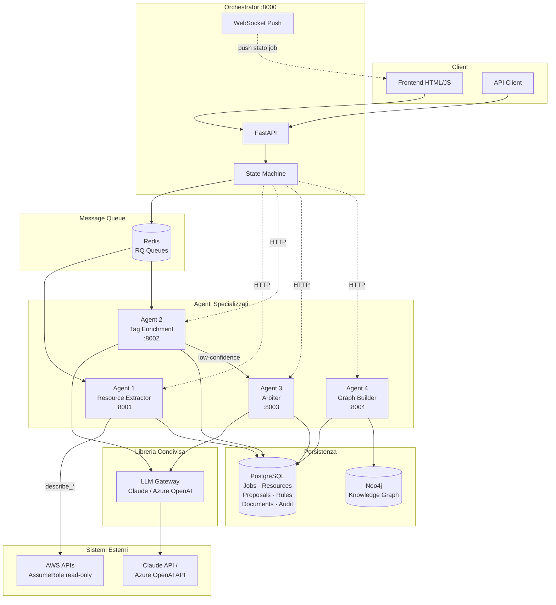
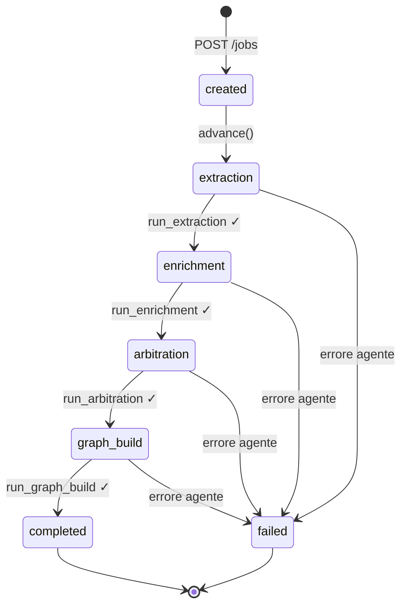

# FinOps Tagging Multi-Agent Platform

Piattaforma multi-agente per la valorizzazione automatica e auditabile dei tag FinOps su risorse AWS. Il sistema combina estrazione cloud, document intelligence, policy engine e knowledge graph per garantire coerenza, tracciabilità e governance del tagging in ambienti multi-tenant.

---

## Indice

- [Panoramica](#panoramica)
- [Architettura](#architettura)
- [Componenti](#componenti)
- [Flusso della Pipeline](#flusso-della-pipeline)
- [Modello dati](#modello-dati)
- [Modello di sicurezza](#modello-di-sicurezza)
- [Stack tecnologico](#stack-tecnologico)
- [Prerequisiti](#prerequisiti)
- [Avvio rapido](#avvio-rapido)
- [API Reference](#api-reference)
- [Testing](#testing)
- [Configurazione](#configurazione)

---

## Panoramica

La piattaforma risolve il problema della valorizzazione manuale e inconsistente dei tag FinOps su infrastrutture AWS complesse. Data un'infrastruttura AWS e un corpus documentale di progetto (HLD, LLD, assessment, tagging strategy), il sistema:

1. **Estrae** tutte le risorse AWS (EC2, VPC, S3, RDS, …) con le loro relazioni architetturali.
2. **Valorizza** automaticamente i tag obbligatori (`environment`, `cost-center`, `team`, `application`, `business-unit`) usando document intelligence + LLM.
3. **Arbitra** i casi ambigui tramite un motore di regole riutilizzabili con fallback LLM e revisione umana.
4. **Costruisce** un knowledge graph navigabile per dimensione architettural e per valore di tag.
5. **Traccia** ogni valorizzazione con fonte, confidenza e timestamp in un audit trail completo.

---

## Architettura



### State Machine della Pipeline



---

## Componenti

### Orchestrator (`orchestrator/` — porta 8000)

Cuore del sistema. Espone le REST API verso i client, mantiene lo stato di ogni job in PostgreSQL e coordina l'esecuzione tramite code RQ su Redis.

| Responsabilità | Dettaglio |
|---|---|
| Gestione job lifecycle | Crea, aggiorna, monitora i job |
| State machine | Transizioni `created → extraction → enrichment → arbitration → graph_build → completed` |
| Task dispatch | Accoda i task RQ per ogni fase sul worker Windows-compatibile |
| WebSocket push | Aggiornamento live dello stato al frontend ogni 2s |
| Error handling | Marca il job `failed` se un agente risponde con errore |

**Windows compatibility**: usa `WindowsWorker(SimpleWorker)` con `TimerDeathPenalty` al posto del worker Unix standard (che richiede `os.fork()` e `SIGALRM`, non disponibili su Windows).

---

### Agent 1 — Resource Extractor (`agent1_resource_extractor/` — porta 8001)

Estrae tutte le risorse AWS di un account/region e ne normalizza la rappresentazione.

| Responsabilità | Dettaglio |
|---|---|
| Estrazione risorse | EC2, Volume, VPC, Subnet, SecurityGroup, S3 Bucket |
| Relazioni architetturali | CONTAINS, SECURED_BY, ATTACHED_TO (inferite dai metadati) |
| Credenziali AWS | Esclusivamente via **AssumeRole** con policy read-only |
| Fallback | Config `select_resource_config` → fallback a `describe_*` se Config non disponibile |
| Persistenza | Upsert in `raw_resources` (PostgreSQL) |

---

### LLM Gateway (`llm_gateway/` — libreria condivisa)

Astrazione comune su LLM diversi. Usata da Agent 2 e Agent 3 come dipendenza installata localmente.

| Feature | Dettaglio |
|---|---|
| Provider supportati | `claude` (Anthropic SDK) · `azure_openai` (openai SDK) |
| Selezione runtime | Variabile d'ambiente `LLM_PROVIDER` |
| Retry automatico | Fino a 3 tentativi su JSON malformato, con messaggio di correzione al modello |
| Fence stripping | Rimuove automaticamente i blocchi ` ```json ` dalla risposta |
| Validazione | Output validato con Pydantic prima di essere restituito al chiamante |

---

### Agent 2 — Tag Enrichment (`agent2_tag_enrichment/` — porta 8002)

Valorizza automaticamente i tag obbligatori usando RAG su documentazione di progetto.

| Responsabilità | Dettaglio |
|---|---|
| Document ingestion | Parsing, chunking, embedding (256-dim, deterministico SHA-256 + numpy) |
| Retrieval | Similarità coseno in Python su embedding BYTEA (no pgvector richiesto) |
| LLM enrichment | Propone valori di tag con score di confidenza per ogni risorsa |
| Arbitration trigger | Chiama Agent 3 per i tag con `confidence < 0.6` |
| Persistenza | Upsert in `tag_proposals` con source, confidence, source_ref |

Tag obbligatori valorizzati: `environment` · `cost-center` · `team` · `application` · `business-unit`

---

### Agent 3 — Arbiter & Policy Registry (`agent3_arbiter/` — porta 8003)

Risolve i casi ambigui e costruisce un registro di regole riutilizzabili per tenant.

| Responsabilità | Dettaglio |
|---|---|
| Rule matching | Cerca regola approvata per `(tenant_id, tag_key, resource_type)` |
| LLM fallback | Se nessuna regola → chiama LLM per proporre valore + regola generalizzabile |
| Regola proposta | Salvata con status `proposed`; un operatore la approva/rifiuta |
| Cache automatica | La seconda richiesta identica usa la regola approvata senza LLM |
| API di gestione | CRUD su regole e su `mandatory_resource_types` per tenant |

---

### Agent 4 — Knowledge Graph Builder (`agent4_graph_builder/` — porta 8004)

Costruisce e mantiene un knowledge graph interrogabile in Neo4j.

| Responsabilità | Dettaglio |
|---|---|
| Nodi Resource | Upsert con tutte le proprietà appiattite (tipo, regione, account, attributi) |
| Nodi tag-dimensione | Environment · CostCenter · BusinessUnit · Application · Team |
| Relazioni architetturali | CONTAINS · ATTACHED_TO · SECURED_BY · DEPENDS_ON (whitelist Python, senza APOC) |
| Relazioni tag | IN_ENVIRONMENT · CHARGED_TO · BELONGS_TO_BU · PART_OF_APPLICATION · OWNED_BY |
| Navigazione attributi | `GET /graph/group?dimension=resource_type&value=AWS::EC2::Instance` |
| Navigazione tag | `GET /graph/group?dimension=business-unit&value=BU-Engineering` |
| Ricerca fulltext | Regex case-insensitive su ARN, tipo, regione, valori dei tag |

---

## Flusso della Pipeline

```
1. POST /jobs  →  {job_id, account_id, region, tenant_id}
                   ↓
2. EXTRACTION   Agent 1 estrae risorse AWS → raw_resources
                   ↓
3. ENRICHMENT   Agent 2 ingesta documenti → retrieval → LLM
                → tag_proposals (confidence ≥ 0.6: direct)
                → Agent 3 (confidence < 0.6: arbitration)
                   ↓
4. ARBITRATION  Secondo pass low-confidence → Agent 3
                Auto-approve proposals pipeline
                   ↓
5. GRAPH BUILD  Agent 4 legge raw_resources + approved tag_proposals
                → upsert Neo4j (nodi Resource + dimensioni tag)
                   ↓
6. COMPLETED    Job terminato, grafo interrogabile
```

---

## Modello dati

### PostgreSQL (schema relazionale)

```
jobs                    — stato pipeline per ogni account/tenant
documents               — documenti di progetto (HLD, LLD, ecc.)
document_chunks         — chunk con embedding BYTEA per RAG
raw_resources           — risorse AWS estratte (JSON attributi + relazioni)
tag_proposals           — proposte di valorizzazione tag (review_status: pending/approved/rejected)
tenant_tagging_rules    — regole riutilizzabili (proposed → approved/rejected)
arbitration_requests    — audit trail di ogni arbitrazione LLM
mandatory_resource_types — tipi risorsa obbligatori per tenant
```

### Neo4j (knowledge graph)

```
Nodi:      Resource · Environment · CostCenter · BusinessUnit · Application · Team · Tenant
Rel. arch: CONTAINS · ATTACHED_TO · SECURED_BY · DEPENDS_ON · ROUTES_TO
Rel. tag:  IN_ENVIRONMENT · CHARGED_TO · BELONGS_TO_BU · PART_OF_APPLICATION · OWNED_BY · IN_TENANT
Indici:    arn · resource_type · region · account_id · job_id (su Resource)
           name/code (su nodi dimensione)
```

---

## Modello di sicurezza

| Principio | Implementazione |
|---|---|
| Credenziali AWS | Solo **AssumeRole** con policy read-only; mai chiavi statiche in codice o DB |
| API key LLM | Solo da variabili d'ambiente; mai hardcoded; mai loggate |
| Audit trail tag | Ogni valorizzazione tracciata in `tag_proposals` e `arbitration_requests` con fonte, confidenza, timestamp, autore |
| Relazioni Neo4j | Tipo relazione validato su whitelist Python prima dell'interpolazione Cypher (no injection) |
| Token interno | `INTERNAL_SERVICE_TOKEN` per autenticazione inter-servizi |

---

## Stack tecnologico

| Layer | Tecnologia |
|---|---|
| Runtime | Python 3.11 |
| API Framework | FastAPI 0.115 + Pydantic v2 |
| Task Queue | RQ 1.16.1 + Redis 3.5.3 (Windows-compatible) |
| DB relazionale | PostgreSQL 16 (psycopg2-binary, asyncpg) |
| Graph DB | Neo4j 5.26 Community |
| LLM | Anthropic Claude / Azure OpenAI (via LLM Gateway) |
| AWS SDK | boto3 + moto 5 (test) |
| Test | pytest + pytest-asyncio + httpx |

---

## Prerequisiti

- Python 3.11+
- PostgreSQL 16 (`finops` database, utente `finops`)
- Redis 3.x (su Windows: [tporadowski/redis](https://github.com/tporadowski/redis/releases))
- Neo4j 5.x Community (Java 21)
- Account AWS con permesso `sts:AssumeRole` verso il role target

---

## Avvio rapido

### 1. Variabili d'ambiente

```bash
cp .env.example .env
# Compilare: DATABASE_URL, REDIS_URL, NEO4J_*, LLM_PROVIDER + chiave LLM, AWS_ASSUME_ROLE_ARN
```

### 2. Schema database

```bash
psql -U finops -d finops -f migrations/001_init_native.sql
```

### 3. Schema Neo4j

```cypher
# Eseguire in Neo4j Browser:
# (contenuto di migrations/neo4j-init.cypher)
```

### 4. Installazione dipendenze

```powershell
# LLM Gateway (libreria condivisa — va installata per prima)
cd llm_gateway && pip install -e . && cd ..

# Ogni servizio ha il proprio requirements.txt
foreach ($svc in @("orchestrator","agent1_resource_extractor","agent2_tag_enrichment","agent3_arbiter","agent4_graph_builder")) {
    pip install -r "$svc\requirements.txt"
}
```

### 5. Avvio servizi (7 terminali)

```powershell
# Orchestrator API
cd orchestrator
uvicorn app.main:app --host 0.0.0.0 --port 8000 --reload

# Orchestrator Worker (task extraction/enrichment/arbitration/graph_build)
rq worker extraction enrichment arbitration graph_build `
   --worker-class app.worker.WindowsWorker `
   --url redis://localhost:6379/0

# Agent 1 — Resource Extractor
cd agent1_resource_extractor
uvicorn app.main:app --host 0.0.0.0 --port 8001 --reload
rq worker extraction --worker-class app.worker.WindowsWorker --url redis://localhost:6379/0

# Agent 2 — Tag Enrichment
cd agent2_tag_enrichment
uvicorn app.main:app --host 0.0.0.0 --port 8002 --reload
rq worker enrichment --worker-class app.worker.WindowsWorker --url redis://localhost:6379/0

# Agent 3 — Arbiter (solo API, nessun worker RQ)
cd agent3_arbiter
uvicorn app.main:app --host 0.0.0.0 --port 8003 --reload

# Agent 4 — Graph Builder (solo API, nessun worker RQ)
cd agent4_graph_builder
uvicorn app.main:app --host 0.0.0.0 --port 8004 --reload
```

### 6. Primo job

```bash
# Crea un job
curl -X POST http://localhost:8000/jobs \
  -H "Content-Type: application/json" \
  -d '{"account_id":"123456789012","region":"eu-south-1","tenant_id":"cineca","documents":[]}'

# Avvia la pipeline
curl -X POST http://localhost:8000/jobs/{JOB_ID}/advance

# Monitora lo stato
curl http://localhost:8000/jobs/{JOB_ID}

# Interroga il grafo (dopo completamento)
curl "http://localhost:8004/graph/group?dimension=business-unit&value=BU-Engineering"
curl "http://localhost:8004/graph/resource/arn:aws:ec2:eu-south-1:123456789012:instance/i-xxx"
```

---

## API Reference

### Orchestrator (:8000)

| Method | Path | Descrizione |
|--------|------|-------------|
| `POST` | `/jobs` | Crea un nuovo job |
| `GET` | `/jobs` | Lista tutti i job |
| `GET` | `/jobs/{id}` | Stato di un job |
| `POST` | `/jobs/{id}/advance` | Avanza la state machine |
| `POST` | `/jobs/{id}/fail` | Marca il job come fallito |
| `WS` | `/jobs/{id}/ws` | Push stato real-time |

### Agent 1 — Resource Extractor (:8001)

| Method | Path | Descrizione |
|--------|------|-------------|
| `POST` | `/extract/full` | Estrazione asincrona completa (RQ) |
| `POST` | `/extract/resource-type/{type}` | Estrazione sincrona per tipo risorsa |
| `GET` | `/extract/status/{task_id}` | Stato del task RQ |

### Agent 2 — Tag Enrichment (:8002)

| Method | Path | Descrizione |
|--------|------|-------------|
| `POST` | `/documents/ingest` | Ingestione documento (parsing + embedding) |
| `POST` | `/enrich/run` | Avvia enrichment asincrono (RQ) |
| `GET` | `/enrich/status/{job_id}` | Conteggio proposals generate |

### Agent 3 — Arbiter (:8003)

| Method | Path | Descrizione |
|--------|------|-------------|
| `POST` | `/arbitrate` | Richiesta di arbitrazione per un tag |
| `GET` | `/rules?tenant_id=` | Lista regole del tenant |
| `POST` | `/rules/{id}/approve` | Approva una regola proposta |
| `POST` | `/rules/{id}/reject` | Rifiuta una regola proposta |
| `GET/POST` | `/resource-types` | Tipi risorsa obbligatori per tenant |

### Agent 4 — Graph Builder (:8004)

| Method | Path | Descrizione |
|--------|------|-------------|
| `POST` | `/graph/build` | Costruisce/aggiorna il grafo per un job |
| `GET` | `/graph/resource/{arn}` | Sottografo centrato su ARN (depth configurabile) |
| `GET` | `/graph/group` | Naviga per dimensione (tag o attributo risorsa) |
| `GET` | `/graph/search?q=` | Ricerca fulltext su ARN, tipo, regione, tag |

#### Esempi di navigazione grafo

```bash
# Per tag-dimensione
GET /graph/group?dimension=environment&value=production
GET /graph/group?dimension=business-unit&value=BU-Engineering
GET /graph/group?dimension=cost-center&value=CC-IT-001

# Per attributo risorsa
GET /graph/group?dimension=resource_type&value=AWS::EC2::Instance
GET /graph/group?dimension=region&value=eu-south-1
GET /graph/group?dimension=instance_type&value=t3.medium

# Sottografo (relazioni architetturali + tag)
GET /graph/resource/arn:aws:ec2:eu-south-1:123456789012:instance/i-abc?depth=2

# Ricerca libera
GET /graph/search?q=production
GET /graph/search?q=eu-south-1
```

---

## Testing

Ogni componente ha la propria suite di test. I test usano PostgreSQL e Neo4j reali; `boto3` è mockato con `moto`.

```powershell
# Agent 1 — Resource Extractor
cd agent1_resource_extractor
python -m pytest tests/ -v

# Agent 2 — Tag Enrichment
cd agent2_tag_enrichment
python -m pytest tests/ -v

# Agent 3 — Arbiter & Policy Registry
cd agent3_arbiter
python -m pytest tests/ -v

# Agent 4 — Knowledge Graph Builder
cd agent4_graph_builder
python -m pytest tests/ -v

# Orchestrator — Integrazione end-to-end (tutti i task mockati)
cd orchestrator
python -m pytest tests/ -v
```

### Copertura test

| Suite | Test | Coverage |
|-------|------|----------|
| Agent 1 (extractor) | 6 | Estrazione EC2/VPC/Subnet/SG/Volume/S3, relazioni architetturali |
| Agent 3 (arbiter) | 5 | Rule matching, LLM fallback, approve/reject, idempotenza |
| Agent 4 (graph) | 8 | Sottografo, navigazione tag, navigazione attributi, whitelist, HTTP build |
| Orchestrator e2e | 6 | Pipeline completa, failure extraction/graph_build, timeout, auto-approve |

---

## Configurazione

| Variabile | Default | Descrizione |
|-----------|---------|-------------|
| `DATABASE_URL` | — | Stringa connessione PostgreSQL |
| `REDIS_URL` | `redis://localhost:6379/0` | Stringa connessione Redis |
| `NEO4J_URI` | `bolt://localhost:7687` | URI Neo4j Bolt |
| `NEO4J_USER` | `neo4j` | Utente Neo4j |
| `NEO4J_PASSWORD` | — | Password Neo4j (obbligatoria) |
| `LLM_PROVIDER` | `claude` | Provider LLM (`claude` \| `azure_openai`) |
| `ANTHROPIC_API_KEY` | — | Chiave API Anthropic |
| `ANTHROPIC_MODEL` | `claude-sonnet-4-6` | Modello Claude |
| `AZURE_OPENAI_API_KEY` | — | Chiave API Azure OpenAI |
| `AZURE_OPENAI_ENDPOINT` | — | Endpoint Azure OpenAI |
| `AZURE_OPENAI_DEPLOYMENT` | — | Nome deployment Azure |
| `AWS_ASSUME_ROLE_ARN` | — | ARN del role da assumere per l'estrazione AWS |
| `AWS_DEFAULT_REGION` | `eu-south-1` | Region AWS di default |
| `AGENT1_URL` | `http://localhost:8001` | URL Agent 1 (visto dall'orchestratore) |
| `AGENT2_URL` | `http://localhost:8002` | URL Agent 2 |
| `AGENT3_URL` | `http://localhost:8003` | URL Agent 3 |
| `AGENT4_URL` | `http://localhost:8004` | URL Agent 4 |
| `ORCHESTRATOR_URL` | `http://localhost:8000` | URL orchestratore (visto dai worker) |
| `ENRICHMENT_CONFIDENCE_THRESHOLD` | `0.6` | Soglia confidenza sotto cui si attiva l'arbitration |
| `TASK_POLL_INTERVAL_S` | `5` | Secondi tra un polling e l'altro (worker) |
| `TASK_POLL_TIMEOUT_S` | `600` | Timeout massimo per il completamento di un task agente |
| `INTERNAL_SERVICE_TOKEN` | `changeme` | Token per autenticazione inter-servizi |

---

## Struttura del repository

```
finops-tagging-platform/
├── migrations/
│   ├── 001_init_native.sql      # Schema PostgreSQL (native, no pgvector)
│   └── neo4j-init.cypher        # Constraint e indici Neo4j
├── orchestrator/                # State machine + API jobs + Worker RQ
│   ├── app/
│   │   ├── main.py              # FastAPI endpoints
│   │   ├── state_machine.py     # Transizioni di fase
│   │   ├── tasks.py             # Task RQ reali (chiamate HTTP agli agenti)
│   │   └── worker.py            # WindowsWorker (SimpleWorker + TimerDeathPenalty)
│   └── tests/test_e2e.py        # Test integrazione pipeline completa
├── llm_gateway/                 # Libreria condivisa (pip install -e)
│   └── llm_gateway/
│       ├── base.py              # LLMClient Protocol, LLMMessage, LLMResponse
│       ├── claude_client.py     # ClaudeClient con retry + fence stripping
│       ├── azure_openai_client.py
│       └── factory.py           # get_llm_client() da env
├── agent1_resource_extractor/   # Estrazione risorse AWS
│   ├── app/
│   │   ├── aws_client.py        # AWSClient (AssumeRole + describe_*)
│   │   ├── db.py                # upsert raw_resources
│   │   └── worker.py            # WindowsWorker + run_extraction task
│   └── tests/test_extractor.py
├── agent2_tag_enrichment/       # Document intelligence + tag proposals
│   ├── app/
│   │   ├── ingestion.py         # Parsing + chunking documenti
│   │   ├── embedding.py         # Embedding deterministico 256-dim
│   │   ├── retrieval.py         # Cosine similarity in Python (no pgvector)
│   │   ├── enrichment.py        # Loop enrichment + chiamata Agent 3
│   │   └── worker.py            # WindowsWorker + run_enrichment task
│   └── tests/
├── agent3_arbiter/              # Policy registry + LLM arbitration
│   ├── app/
│   │   ├── main.py              # /arbitrate, /rules, /resource-types
│   │   ├── rules_engine.py      # match_rule + apply_rule
│   │   └── db.py                # find_approved_rule, insert_proposed_rule
│   └── tests/test_arbiter.py
├── agent4_graph_builder/        # Knowledge graph Neo4j
│   ├── app/
│   │   ├── neo4j_client.py      # build_graph, subgraph, group, search
│   │   ├── db.py                # load da PostgreSQL
│   │   └── main.py              # /graph/build, /graph/resource, /graph/group, /graph/search
│   └── tests/test_graph_builder.py
├── frontend/                    # Dashboard HTML/JS (statica)
│   ├── index.html               # Lista job + creazione
│   ├── dashboard.html           # Monitoring pipeline
│   ├── review.html              # Revisione tag proposals
│   ├── rules.html               # Gestione regole arbiter
│   └── graph.html               # Visualizzazione knowledge graph
├── scripts/
│   ├── setup-native-windows.ps1 # Setup ambiente Windows nativo
│   └── setup-native-apply.ps1
├── docker-compose.yml           # Avvio infrastruttura (Postgres + Redis + Neo4j)
└── .env.example                 # Template variabili d'ambiente
```

---

## Licenza

Progetto interno. Tutti i diritti riservati.
